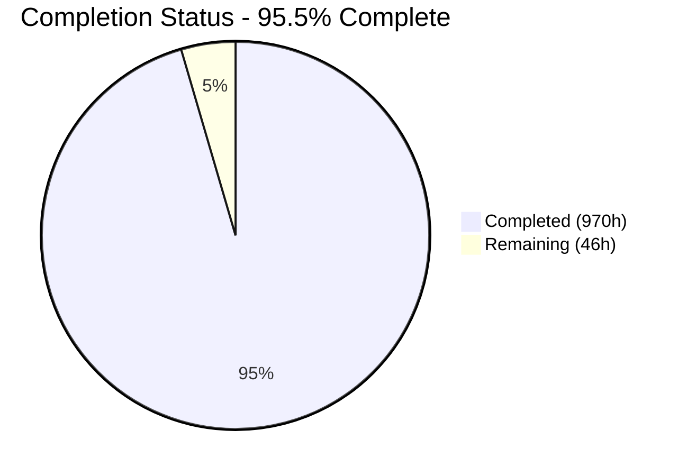
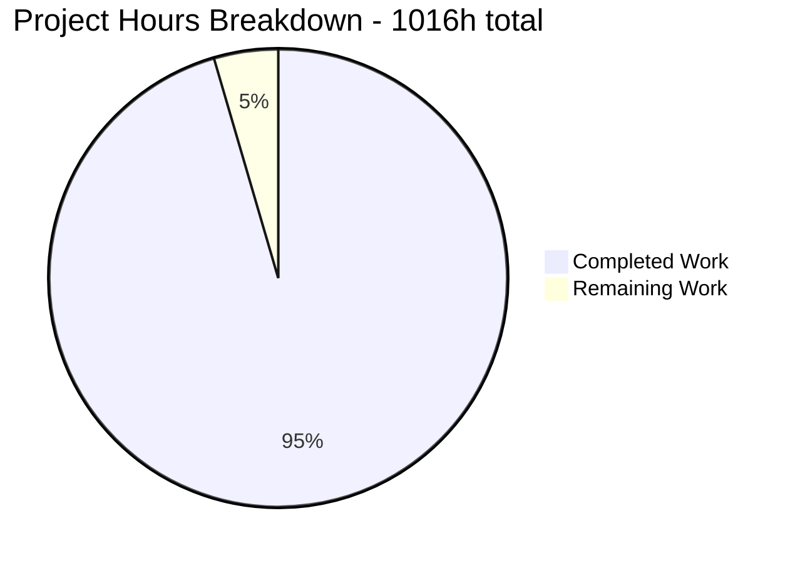
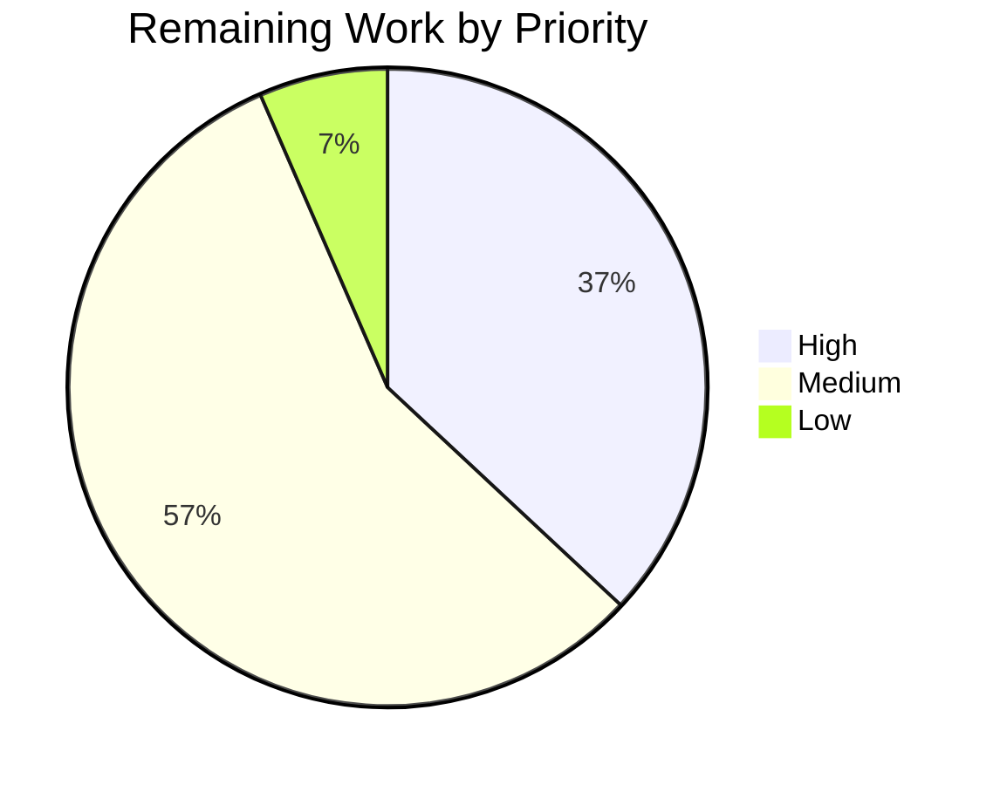
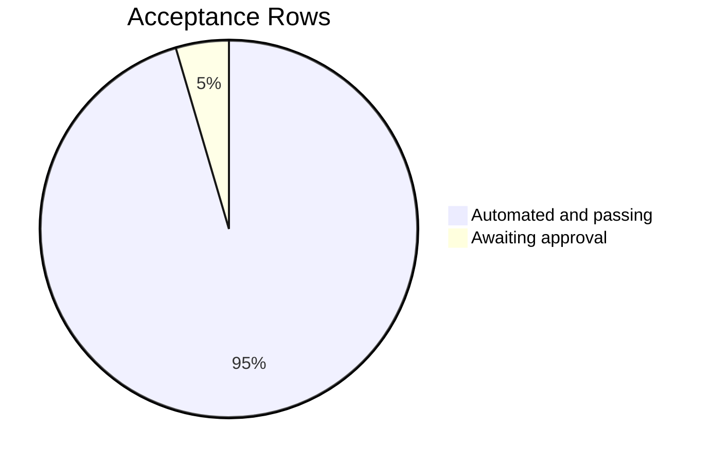

# 1. Executive Summary

## 1.1 Project Overview

This project ports Java `strata-basics`, and the part of `strata-collect` it uses, to idiomatic functional Scala 2.13.18 on JDK 21, built by sbt as exactly two Scala-only modules. Conventions, calendars, schedules, currencies, FX and indices keep their Java names, wire forms and numeric answers, while the INI enum registry becomes closed sealed families, thrown failures become `Either` over a sealed error model, Joda-Beans serialization becomes compile-time circe codecs, and reference data is threaded explicitly. Guava, Joda and the Java `strata-collect` jar are off the classpath.

## 1.2 Completion Status

**970 of 1,016 hours complete — 95.5% of the Agent Action Plan's scope, including path-to-production work.**



<!-- Chart colours: Completed = Dark Blue #5B39F3 · Remaining = White #FFFFFF -->

| Metric | Value |
|---|---|
| Total Hours | 1,016 |
| Completed Hours (AI + Manual) | 970 |
| Remaining Hours | 46 |
| Percent Complete | 95.5% |

Calculation: 970 ÷ (970 + 46) × 100 = 95.5%.

## 1.3 Key Accomplishments

- ✅ Two Scala-only modules — 95 main, 108 test sources — warning-clean under `-release 21 -Werror`, bytecode 65.
- ✅ 5,939 tests in 102 suites pass, zero failures (`strata-basics` 4,116, `strata-collect` 1,823).
- ✅ Numeric parity with Java to 1e-9 absolute **and** relative over 23,144 baseline rows.
- ✅ 15 closed sealed families, 865 members, every alias and lenient row resolving as Java does.
- ✅ Reference data as code — 74 currencies, 331 index rows, 26 dated calendars, 251 countries — manifest-checked.
- ✅ circe codecs for 58 public types, 40 reasoned exclusions, no reflection on the path.
- ✅ No `null`, no thrown failure outside the fail-fast helper, 33 validated types built only through factories.
- ✅ One command passes all 21 automated acceptance rows.

## 1.4 Critical Unresolved Issues

**1 of the 22 acceptance rows is open** — Gate 7's out-of-band approval; the other 21 pass. Two further items sit outside the delivered code, in repository governance the plan excluded.

| Issue | Impact | Owner | ETA |
|---|---|---|---|
| The migration note's manual approval (1 of 22 acceptance rows) is not recorded | Acceptance is incomplete until a code owner approves `SCALA_MIGRATION.md` against its six mandated sections; no code or test is affected | Code owner / reviewer | 2h |
| The Scala acceptance job has not run on the CI provider, and auto-merge is gated on `check-success=build` alone, so the job is informational | A regression can reach the default branch unless `scripts/verify-gates.sh` is run before merge | Build / release engineer | 5h |
| No automated advisory monitoring watches the sbt dependency surface | The dependency set is clean and pinned today; nothing preserves that automatically, and a manual review cadence is the current control | Platform / security owner | 4h |

## 1.5 Access Issues

No access issues identified. Every dependency resolves from Maven Central, no credential or private repository is required, and nothing binds a port or calls an external service.

## 1.6 Recommended Next Steps

1. **[High]** Record the code owner's approval of `SCALA_MIGRATION.md` and sign off the branch (10h).
2. **[High]** Run the Scala acceptance job on CI and make it a required merge check (5h).
3. **[High]** Decide the three open divergences: test-report writer, evidence publication, calendar resolution (2h).
4. **[Medium]** Add publishing and release wiring for the two modules; none exists, by plan (12h).
5. **[Medium]** Install advisory monitoring and coverage instrumentation, neither configured today (10h).

# 2. Project Hours Breakdown

## 2.1 Completed Work Detail

Each component traces to a deliverable of the Agent Action Plan. Hours reflect implementation, the tests that prove it, and the debugging to green.

| Component | Hours | Description |
|---|---|---|
| sbt build definition and project configuration | 16 | Exactly two projects with `strata-basics` as the root project depending on `strata-collect`, `-release 21 -Werror`, Scala-only source roots, forked tests, one report directory (`build.sbt`, `project/`, `.gitignore`) |
| `strata-collect` — validation, error model, name lookup | 62 | `ArgCheck`/`Validate`, the ten-variant sealed `Failure` model with its result aliases, `Named`/`NamedEnum`/`TypedString`, `Collections`; reproduces the Java lenient-lookup algorithm for 15 closed families |
| `strata-collect` — numeric core | 60 | `DoubleArray`, `DoubleMatrix`, `Matrix`, `DoubleArrayMath`, `Decimal`, `FixedScaleDecimal`: copy-safe public API over private primitive arrays, IEEE-aware equality, zero boxing in the hot paths |
| `strata-collect` — codecs and IO edge | 30 | `json/Codecs` (tagged non-finite doubles, validated decoders, key and array codecs) and `io/Resources`, the module's only effectful surface |
| `strata-basics` — reference data and root contracts | 32 | Open `ReferenceData` trait with immutable, combined and holiday-safe implementations, typed identifiers, `StandardId`, `StandardSchemes`, forward-path target traits, the `RefDataReader` alias |
| `strata-basics` — currency and FX | 72 | 74 currencies and 92 conventional-pair rows, amounts and scenario arrays, `Money`/`BigMoney` over exact decimals, `FxRate`, `FxRateProvider`, insertion-ordered `FxMatrix` with quadratic construction |
| `strata-basics` — dates, calendars and conventions | 120 | 21 day counts plus `Bus/252`, the sealed calendar family with bitmask lookup, 25 rule-based generators plus `THBA` and the weekend calendars, calendar identifiers with composite resolution, business-day/days/period/tenor adjustments, `Tenor`, `MarketTenor`, date sequences |
| `strata-basics` — index families and tables | 80 | Sealed `Index`/`RateIndex`/`FloatingRateIndex` with four leaf families from transcribed data (271 Ibor, 35 overnight, 9 price, 16 FX rows), 41 floating-rate names with 404 alias rows, four ordered parse unions, five observation types |
| `strata-basics` — schedule generation | 56 | `PeriodicSchedule` generation and refusal semantics, `Schedule`/`SchedulePeriod` with non-empty periods, 45 roll conventions, `Frequency`, stub conventions |
| `strata-basics` — value schedules and rounding | 28 | `Rounding`, `ValueAdjustment`(`Type`), `ValueDerivatives`, `ValueSchedule`, `ValueStep`, `ValueStepSequence` |
| `strata-basics` — country and reference tables | 10 | Validated open `Country` value with 251 alpha-3 → alpha-2 rows |
| Demo application | 6 | `BasicsDemoApp` — schedule, calendar adjustment, FX conversion and JSON in one documented command |
| `strata-collect` test suite | 60 | 22 specs / 1,823 tests: unit, table-driven and property-based, with the shared matcher kit and generators |
| `strata-basics` test suite | 170 | 86 specs / 4,116 tests, including the seven cross-cutting audit suites (API surface, smart constructors, failable surface, typeclass laws, closed families, reference-data manifest, JSON round-trip) |
| Parity harness and parity specs | 30 | Strict fixture schema, conjunctive 1e-9 comparison, report-before-assert contract, and the six specs that replay 23,144 rows |
| Java baseline capture tooling and captured documents | 44 | The JShell capture tool, six parity baselines and the reference-data manifest, reproducible byte for byte, plus the method-level Java-to-Scala test ledger |
| Acceptance gate runner | 52 | 21 automated rows with per-row evidence, aggregated parity/test/codec figures, output locking and sanitized evidence publication |
| Continuous-integration job | 10 | `scala_build21` on a pinned JDK 21 image with toolchain assertions, checksum-pinned sbt install, caching and evidence publication |
| Documentation | 32 | `SCALA_MIGRATION.md` (member-level symbol table, 59-row divergence register, JSON shapes, calendar set, dependency cadence), the root README's Scala-port section, both module READMEs and the capture procedure |
| **Total** | **970** | |

## 2.2 Remaining Work Detail

| Category | Hours | Priority |
|---|---|---|
| Migration-note approval and branch sign-off (closes the one open acceptance row) | 10 | High |
| CI execution of the Scala acceptance job and promotion to a required merge check | 5 | High |
| Recorded-divergence acceptance decisions (test-report writer, evidence publication shape, linked-composite calendar resolution) | 2 | High |
| Publishing and release wiring for the two Scala modules | 12 | Medium |
| Automated dependency-advisory monitoring for the sbt surface | 4 | Medium |
| Line/branch coverage instrumentation and first baseline | 6 | Medium |
| Development-guide walkthrough on a clean machine, including the baseline-capture route | 4 | Medium |
| Retirement plan for the Java `modules/collect` and `modules/basics` trees | 3 | Low |
| **Total** | **46** | |

## 2.3 Hours Summary

| Measure | Hours |
|---|---|
| Completed (Section 2.1) | 970 |
| Remaining (Section 2.2) | 46 |
| **Total project hours** | **1,016** |

Completion: 970 ÷ 1,016 = 95.5%. Confidence is high for the completed figure — every row is backed by delivered sources, executed tests and acceptance-gate evidence — and high for the remaining figure, whose items are governance, release and instrumentation tasks with well-understood shapes rather than open engineering questions.

# 3. Test Results

Every figure below was observed in a full run of `sbt -batch clean compile Test/compile test` on the delivered branch, then cross-checked against the 102 JUnit XML reports the run wrote. Frameworks: ScalaTest 3.2.20 with ScalaCheck 1.20.0, plus cats-laws/discipline for the law suites and cats-effect-testing for the fixture replays.

| Area / Category | Framework | Tests | Passed | Failed | Coverage | What This Proves |
|---|---|---|---|---|---|---|
| `strata-basics` domain families — date, currency, index, schedule, value, location | ScalaTest + ScalaCheck | 1,349 | 1,349 | 0 | Not instrumented | Day counts, calendars, adjustments, FX and schedule generation answer as the Java originals do, including their refusal cases |
| `strata-basics` cross-cutting audits — API surface, smart constructors, failable surface, typeclass laws, closed families, reference-data manifest | ScalaTest + ScalaCheck + discipline | 2,540 | 2,540 | 0 | Not instrumented | Validated types cannot be built around their factories, 218 typeclass instances obey their laws, and every transcribed data table equals the Java-captured manifest |
| `strata-basics` JSON round-trip | ScalaTest + ScalaCheck | 172 | 172 | 0 | Not instrumented | 58 public types survive encode→decode unchanged, byte-stably, with 40 reasoned exclusions and no reflection on the path |
| `strata-collect` core — validation, names, decimals, collections, test kit | ScalaTest + ScalaCheck | 1,185 | 1,185 | 0 | Not instrumented | Lenient name lookup matches the Java algorithm for all 15 closed families, and fail-fast versus accumulating validation behave as documented |
| `strata-collect` result model | ScalaTest + ScalaCheck | 228 | 228 | 0 | Not instrumented | Failures carry reason, message and sorted attributes, accumulate in order, and render as one bounded escaped line |
| `strata-collect` numerics, codecs and IO edge | ScalaTest + ScalaCheck | 398 | 398 | 0 | Not instrumented | Arrays and matrices are copy-safe and IEEE-exact, codecs handle non-finite values, and the text reader refuses anything that is not a readable regular file |
| Parity replay against the Java baselines (both modules) | ScalaTest + cats-effect-testing | 67 | 67 | 0 | 23,144 baseline rows | Day counts (18,356 rows), holidays (3,846), schedules (879), FX (14), currency math (6) and arrays (43) agree with Java to 1e-9 absolute and relative |
| **Total** | | **5,939** | **5,939** | **0** | | |

**Not covered**

- **No line or branch coverage instrumentation is configured**, so no coverage percentage exists for either module. What stands in its place is a method-level ledger mapping all 1,876 Java test methods of the ported classes to the Scala test that carries each one, enforced as an acceptance row — a traceability measure, not a coverage measure. A human should add coverage tooling before release if a numeric threshold is required.
- **The forward-path contracts** `CalculationTarget`, `Resolvable` and `ResolvableCalculationTarget` have no consumer inside this slice; only the concrete target-list type is exercised. Their fitness for a dependent module is unproven until the next module is ported.
- **No performance or soak suite exists.** Hot paths are held structurally — zero boxing in 198 audited method bodies, quadratic rather than cubic matrix construction, one allocation per numeric result — but no timing or allocation threshold is asserted, so a latency regression would not raise an alarm. A human should add a benchmark if throughput is a release criterion.
- **Java wire compatibility is deliberately absent and therefore untested**: Joda-Beans JSON and binary forms, Java serialization and the legacy calendar fixture are out of scope, and every domain type refuses Java serialization by design.
- **Runtime extensibility has no tests because it no longer exists**: the INI/CSV provider chain and classpath overrides were replaced by closed families, so a consumer that extended a family at runtime has no equivalent to exercise.
- **The continuous-integration job definition has not executed on the provider.** The acceptance script it invokes was run end to end here; the job's own steps — image pinning, toolchain assertion, caching, evidence publication — have been reviewed but not observed running on CI.

# 4. Runtime Validation & UI Verification

There is no user interface: both modules are headless libraries and the only executable is a console application. Nothing binds a port and no external service is contacted, so runtime validation means driving the library's flows and the delivered tooling for real. The lines below record what was executed and observed on the delivered branch.

- ✅ **Operational — Build and start-up.** `sbt -batch clean compile Test/compile test` completes with exit 0 and zero warnings under `-Werror`; both modules' classes report class-file major version 65.
- ✅ **Operational — Demo end-to-end flow.** `sbt -batch "strata-basics/run"` prints all four stages: a quarterly `PeriodicSchedule` from 2024-03-25 to 2025-03-25 resolving to 4 periods, the `GBLO` calendar moving 2024-12-25 to 2024-12-27 in the third and fourth periods, an `FxMatrix[GBP, USD, EUR]` converting `[EUR 500000, GBP 1000000]` to `USD 1815000`, and circe JSON for the schedule, the multi-currency amount and the converted amount.
- ✅ **Operational — Explicit reference-data threading.** Calendar identifiers resolve against `ReferenceData.standard` (30 built-in calendars) and `minimal` (4), composite identifiers resolve whole-then-component, and adjustments compose through their reader form.
- ✅ **Operational — Numeric parity replay.** The six baseline documents are loaded through the effectful reader and replayed in full: 23,144 rows, 0 failures, each report written before its assertion.
- ✅ **Operational — Serialization at runtime.** Encode→decode round-trips run over generated values for all 58 covered types, and a class-load audit of the encode/decode difference (3,712 entries, each disassembled) shows no reflective class on the path.
- ✅ **Operational — Acceptance runner.** `scripts/verify-gates.sh` executes end to end: 21 automated rows pass, 1 row is reported for out-of-band approval, and it writes the aggregated report, per-row evidence and a sanitized publication tree; `--help` exits 0 and a bad argument list exits 2.
- ✅ **Operational — Dependency purity at runtime.** All four resolved classpaths carry no Guava, no Joda and no Java `strata-collect` artefact; the two Compile classpaths are 12 and 13 entries.
- ✅ **Operational — Test-evidence recovery.** A deliberately failing table-driven check over a domain value ends the run promptly and non-zero, names its suite, renders the falsifying row to the console and leaves one complete report — the failure path that matters most for CI.
- ✅ **Operational — Baseline regeneration.** The capture tool runs against the untouched Java jars and reproduces all seven captured documents byte for byte, self-checking 198,884 values against the Java tests' own constants and refusing to write outside its declared output root.
- ⚠ **Partial — Continuous integration.** The job definition is complete and its script was exercised here, but it has not yet run on the CI provider, and auto-merge does not require it.

# 5. Compliance & Quality Review

## 5.1 Compliance Matrix

Each row is the verified state of a mandated deliverable on the delivered branch, measured by the acceptance runner and the test suite.

| Deliverable / Requirement | Benchmark | Status | Evidence |
|---|---|---|---|
| `strata-collect` ported as its own Scala module, with no Java `strata-collect`, Guava or Joda on the classpath | Dependency purity | ✅ PASS | All four resolved classpaths clean; no such reference in `build.sbt` or either source tree |
| Exactly two Scala-only sbt modules, zero `.java` | Build topology | ✅ PASS | Project ids are exactly `strata-basics` (root) and `strata-collect`; 0 `.java` files; Scala-only source roots; the directed dependency edge is real |
| Closed sealed families replace the runtime enum registry, with the INI behaviour ported as data | Design conformance + data fidelity | ✅ PASS | 15 families, 865 members, ~1,400 alias/external/lenient rows resolving; every table equal to the Java-captured manifest; no resource lookup in main sources |
| Numerical parity with the Java implementation | 1e-9 absolute **and** relative | ✅ PASS | Six baselines, 23,144 rows, 0 failed |
| Immutability and no mutable state in domain code | No `var`, copy-safe numerics | ✅ PASS | No occurrence of the token in either module's main sources; no member hands out or adopts backing storage |
| No boxing in the numeric hot paths | Bytecode audit | ✅ PASS | Five hot-path classes, 184 method names / 198 bodies audited through the closed call graph, zero boxing calls |
| Explicit functional error handling over a sealed error model | No `null`, no thrown failure outside the fail-fast helper | ✅ PASS | Both scans clean against their own controls; 33 validated types constructible only through their factories; failable-surface suite green |
| Compile-time JSON derivation with no reflection | Codec purity | ✅ PASS | 58 covered and 40 excluded types matching the closed inventory; 3,712 encode/decode class-load entries disassembled, none reflective |
| Effects confined to the edges | `cats-effect` only in the demo and the collect IO reader | ✅ PASS | Confinement scan clean over both main trees |
| JVM 21 bytecode and a warning-clean build | Major version 65, `-Werror`, no suppression | ✅ PASS | Both sampled classes report major version 65; `-Werror` declared once, no `@nowarn`, `-Wconf` or scoped removal; clean compile |
| Scala collections in the public API | No `java.util` collection, `Optional`, stream or function type | ✅ PASS | Public/protected member scan clean over both modules, with the negative control caught |
| Test scope ≥ Java, working demo, migration note | Traceability, end-to-end flow, documentation | ⚠ PARTIAL | 1,876 Java test methods each mapped and joined to an executed test; both module floors exceeded; demo runs; the note's six sections are present and automated checks pass — the mandated out-of-band approval is outstanding |

## 5.2 AAP & Rule Divergences and Gaps

No user-specified rules were provided for this project, so no user rule could be diverged from; the ten numbered requirements of the build request were each measured and all pass (Section 5.1). Eight divergences from the Agent Action Plan stand. Four are the plan's own sanctioned interpretation choices, three are behavioural or naming decisions taken during delivery, and one is a configuration change forced by a structural conflict between three of the plan's requirements. `SCALA_MIGRATION.md` section (c) additionally carries the full 59-row register of intentional differences from the Java original, all of them plan-mandated.

| What the AAP/Rule Required | What Was Delivered Instead | Why It Diverged | Impact | Remediation |
|---|---|---|---|---|
| §0.3.1: forked tests with ScalaTest's `-u` XML reporter | sbt's own JUnit-XML listener as the single writer, with remote reporting disabled at the framework level (`build.sbt:129`, `:449-454`, `:496`) | Forked tests open ScalaTest's slave reporting socket unconditionally and write a failing row as a Java-serialized object, which every domain type refuses by audited design — the three requirements cannot all hold | None on evidence: identical report naming and keys across 102 suites and 5,939 cases, and the console now renders falsifying rows | Accept the recorded divergence (decision task, Section 2.2) |
| §0.4.1/§0.10.1: publish `target/gate-report.md`, `target/parity-report`, `target/test-reports` and `target/audit` as artifacts | One sanitized `gate-evidence` tree plus structured test results (`.circleci/config.yml:518-525`) | Uploading the raw paths publishes the runner's hostname, account, home and checkout paths and the JUnit properties block | Same four evidence classes reach CI, sanitized; paths inside the tree differ | Accept, or re-add a raw path if a consumer needs one |
| Rule 4 as applied to `Currency`: a closed family | The closed set of 74 ISO codes; `of`/`parse` refuse anything else (`currency/Currency.scala:52-64`), where Java minted a synthetic currency | The plan resolved Rule 4 against Java's dynamic minting in favour of closure (its Conflict 4) — sanctioned | A caller passing an unlisted code now receives a failure rather than a guessed currency | None required; adding a currency is a data-table row plus a test |
| Rule 4 as applied to `FxIndex`: a closed family | The 16 configured indices; the unconfigured-pair fallback is not ported (`index/Index.scala`, `FxIndex` companion) | Sanctioned by the plan's Conflict 7 for the same reason | `FxIndex.of` for an unconfigured pair returns a failure instead of a synthesised index | None required; add the row if a pair must be supported |
| §0.4.1/§0.3.3: `ReferenceDataId` with two members and one localized cast at lookup | A third member, `valueType: ReferenceDataType[T]`, and no cast anywhere (`ReferenceDataId.scala:128`) | A cast at lookup cannot be sound under erasure for an open family parameterized in its value type | Host identifiers must supply a witness; a wrongly typed entry reports absent rather than mistyped | None required; note it when implementing custom identifiers |
| §0.3.3/§0.4.1: `Frequency` holds a normalised `Period` | A year is held as twelve months and named `P12M` (`schedule/Frequency.scala:50`, `:202-216`) | The plan's own constant list, its name-preservation requirement, the Java library's twelve-month special case and every captured baseline all spell the annual frequency in months | None adverse; the canonical name and wire form match Java | None required |
| §0.8.2: preserve Java constant names | `ValueAdjustmentType` members are `Replace`, `DeltaAmount`, `DeltaMultiplier`, `Multiplier` (`value/ValueAdjustmentType.scala:138-174`); the Java spellings survive as lookup keys | The plan's file-specific requirement names these identifiers, and its examples for name preservation are constants holders rather than sealed-family members | Source-level rename for code ported later; name, lookup and JSON forms unchanged | None required; expect the new spellings in the next slice |
| §0.3.3: composite calendar identifiers resolve as Java does | A composite nested inside a linked identifier resolves to a combined calendar where Java refuses (`date/HolidayCalendarId.scala` resolution path) | Component-wise resolution is total by construction, so the pieces resolve and combine instead of the whole-identifier lookup failing | A lookup the Java original rejected now succeeds; callers depending on that refusal see a value | Decide whether to tighten to the Java refusal (decision task, Section 2.2) |

**Test-report writer.** The plan fixes three things at once: tests run in a forked JVM, ScalaTest's `-u` reporter writes the XML the acceptance count is summed from, and no domain type takes part in Java serialization — a property audited across 193 product classes. Forking makes ScalaTest open a slave-to-master socket whose only reporter serializes events, including a failing property's falsifying value, as Java objects; a domain value on that path cannot be written. The delivered build therefore disables remote reporting at the framework level and makes sbt's own listener the single XML writer. Equivalence was established rather than assumed: the same file naming, the same per-suite attributes and an identical `(classname, name)` key set over 102 suites and 5,939 cases. Accept it, or relax the serialization property — which would cost the closure audit.

**Evidence publication.** The plan lists four raw artifact paths for CI. Those directories contain the runner's hostname, account name, home and checkout paths, and the JUnit properties block, all of which would become public build artifacts. The job instead stages a sanitized copy of the same four evidence classes — aggregated report, parity reports, test reports and per-row audit output — under one `gate-evidence` destination, publishes structured test results alongside, and verifies the staged tree against approved digests before upload. Every evidence class the plan wanted remains available to a reviewer; only its path inside the artifact tree differs. If a downstream consumer needs a literal path, re-adding it is a two-line change to the job.

**Closed `Currency`.** The plan resolved the tension between a closed family and Java's habit of minting a currency for any three upper-case letters in favour of closure, and this is what shipped: 74 ISO-4217 codes, 55 of them with named constants, built once at class initialisation. A code outside the set yields a parse failure. The practical consequence is that a consumer who relied on Java guessing zero minor units and USD triangulation for an unknown code now gets an explicit failure at the boundary — better behaviour, but a behaviour change to plan for. Supporting a new currency is a row in the currency table plus its manifest assertion; no registry, INI file or restart-time discovery is involved.

**Closed `FxIndex`.** Java synthesises an FX index for an unconfigured currency pair, using the pair's default calendar and a two-day maturity offset. The port ships the 16 configured indices and no synthesis path, so `FxIndex.of` answers with the configured index of lowest name where one exists and a parse failure otherwise. This is the plan's own resolution of the same closed-family tension, and it removes a class of silently-wrong market conventions: a synthesised index looked authoritative while resting on defaults nobody chose. Teams that priced against synthesised indices must add explicit rows. The default-calendar table Java used for synthesis is retained, because other callers use it.

**Typed reference-data identifiers.** The plan sketched an identifier trait with two members and a single localized cast inside the lookup. Under erasure that cast cannot be sound: the store is heterogeneous, the identifier family is open for hosts to extend, and two identifiers that compare equal can be parameterized differently, so a cast would hand back a value of the wrong type. The delivered trait requires a `valueType` witness and narrows through it, performing no cast at all; a store entry filed under an erased-equal identifier of another type is reported absent. The cost is one extra member for anyone writing a custom identifier, and it is documented on the trait with an example.

**Annual frequency as twelve months.** The plan asks `Frequency` to hold a normalised period, and the JDK's normalisation would render a year as `P1Y`. Everything else in the plan points the other way: its own constant list runs `P1D…P12M`, it requires Java constant names to survive, the Java library's own tenor normalisation special-cases twelve months, and every captured Java baseline spells the annual frequency `P12M`. The delivered type therefore normalises every other length through the JDK and keeps a year as twelve months, so `Frequency.of(Period.ofYears(1))`, `ofMonths(12)` and `parse("P1Y")` all converge on one value whose canonical name matches Java's. No action is needed.

**Value-adjustment type names.** Two plan requirements met here: preserve Java constant names, and implement this file to the identifiers the file-by-file plan lists. The Java names are shouted constants on an enum; the Scala family is a sealed set of case objects whose members the plan spells `Replace`, `DeltaAmount`, `DeltaMultiplier` and `Multiplier`. The delivered code follows the file-specific list, and the Java spellings remain live as lookup keys, so text, JSON and lenient parsing all still resolve `DELTA_AMOUNT`. Only Scala source that names the member directly differs — which matters to the next slice's authors, not to data on the wire. Expect the new spellings when porting dependent modules.

**Linked composite calendars.** The plan requires composite identifiers to resolve as Java does: query the whole identifier first, then fall back to resolving components and combining them. That is what the port does, and for a single composite the outcomes match. They diverge for a composite nested inside a linked identifier: Java's intermediate whole-identifier lookup fails and it throws, while the port's component-wise resolution finds each piece and combines them, answering with a calendar. The port's answer is the more useful one and it is recorded in the migration note with the Java message quoted beside it, but it is a behaviour a caller could have depended on. A human should decide whether to keep it or restore the refusal; the choice is local to one resolution path.

# 6. Risk Assessment

Forward-looking risks only — what could still go wrong in production or in the next slice.

| Risk | Category | Severity | Probability | Mitigation | Status |
|---|---|---|---|---|---|
| The Scala acceptance job is informational: auto-merge is gated on the Maven `build` check alone, so a change could reach the default branch without the gates running | Integration | High | Medium | Run `scripts/verify-gates.sh` before merge; promote the job to a required check (5h, Section 2.2) | Open |
| Numeric parity is measured against committed Java baselines; new behaviour needs a regenerated baseline, which requires the Java tree and JDK 21 | Technical | Medium | Low | The capture tool reproduces all seven documents byte for byte and self-checks 198,884 values against the Java tests' own constants; three capture routes are documented | Mitigated |
| No automated advisory monitoring watches the sbt dependency surface, and sbt version-update automation does not cover security advisories | Security | Medium | Medium | Pinned versions, a dependency-purity gate over all four classpaths, and a documented manual review cadence | Open |
| Closed families mean a new currency, index, calendar or convention needs a code change and a release, not a configuration drop-in; a consumer expecting runtime extension fails at the parse boundary | Technical | Medium | Medium | Behaviour documented in the migration note; every table guarded by the captured manifest; adding a row is a table edit plus a test | Accepted by design |
| The forward-path contracts have no consumer in this slice, so their shape is unproven against a dependent module | Integration | Medium | Medium | Shapes mirror the Java contracts one for one; the concrete target-list type is covered by its spec | Accepted for this slice |
| The test-classpath exclusion of the older property-check adapter is version-coupled; upgrading the law-suite library could silently restore a duplicate adapter | Technical | Low | Low | The dependency row audits all four classpaths for duplicate class names — currently 0 of 55,294 | Monitored |
| Both modules share one test-report directory and one parity-report directory; a future suite with the same fully-qualified name in both modules would overwrite its counterpart | Operational | Low | Low | The build fails a test task whose suite report is missing, older than the run or thinner than what the runner counted; the gate cleans from the root first | Monitored |
| Diagnostics quote caller-supplied identifiers; a future message site that bypasses the shared renderer would lose the bounded, escaped, single-line guarantee | Security | Low | Low | One renderer serves the whole failure model, and its specs assert zero control characters and bounded length for inputs up to 10,000 characters | Mitigated |

# 7. Visual Project Status

**Hours** — Completed = Dark Blue (#5B39F3), Remaining = White (#FFFFFF).



**Remaining work by priority** (46h total: High 17h, Medium 26h, Low 3h).



**Remaining work by category**

| Category | Hours | Share of remaining |
|---|---|---|
| Publishing and release wiring | 12 | 26% |
| Migration-note approval and branch sign-off | 10 | 22% |
| Coverage instrumentation | 6 | 13% |
| CI execution and required check | 5 | 11% |
| Advisory monitoring | 4 | 9% |
| Onboarding walkthrough | 4 | 9% |
| Maven retirement plan | 3 | 6% |
| Divergence acceptance decisions | 2 | 4% |
| **Total** | **46** | **100%** |

**Acceptance rows** — 21 of 22 automated and passing; 1 reported for out-of-band approval.



# 8. Summary & Recommendations

**What was delivered.** The Java `strata-basics` module and the part of `strata-collect` it depends on now exist as two Scala-only sbt modules — 95 main sources and 108 test sources, 71,693 and 115,691 lines respectively — built with Scala 2.13.18 against JDK 21 under `-release 21 -Werror`. Everything the Java version held in configuration is now code: 74 currencies, 92 conventional-pair rows, 271 Ibor, 35 overnight, 9 price and 16 FX index rows, 41 floating-rate names with 404 alias rows, 251 country rows, 25 rule-generated holiday calendars plus the Thai date table and the weekend calendars. The runtime enum registry is gone, replaced by 15 closed sealed families that reproduce the Java lookup algorithm including its alias, external and lenient tables. Thrown failures became `Either`/`EitherNec` over a ten-variant sealed error model; Joda-Beans serialization became compile-time circe codecs for 58 public types; reference data is threaded explicitly and composes through a reader. At 970 of 1,016 hours, the project is **95.5% complete**.

**What was verified.** 5,939 tests across 102 suites pass with no failures, and the port's numbers are pinned to the Java original rather than to themselves: six baselines captured from the untouched Java build are replayed in full — 23,144 rows agreeing to 1e-9 absolute and relative — and every transcribed data table is compared against a separately captured reference-data manifest, so a mistranscribed row fails independently of any round-trip. A single command runs the whole acceptance suite and passes all 21 automated rows, covering dependency purity, build topology, parity, codec coverage, immutability, zero boxing in 198 audited method bodies, absence of reflection on the codec path, JVM 21 bytecode, warning cleanliness, Scala-only public API, the demo, and a per-method ledger joining all 1,876 Java test methods of the ported classes to executed Scala tests. The demo flow — schedule, calendar adjustment, FX conversion, JSON — was driven end to end and produced the expected values.

**What remains.** Forty-six hours, none of it library engineering. Ten hours are the code-owner approval and branch sign-off that close the last acceptance row; five are the first CI run of the Scala job and its promotion to a required merge check, without which the gates do not guard the default branch; two are three divergence decisions a human must own. The other twenty-nine are release readiness the plan deliberately excluded: publishing and release wiring for the two modules, dependency-advisory monitoring, coverage instrumentation, a clean-machine walkthrough of the development guide, and a retirement plan for the Java trees this slice ports from.

**Critical path to production.** Approve the migration note and sign off the branch, then run the acceptance job on CI and make it required — at that point every property this guide reports is enforced on every future change rather than on request. Publishing wiring follows, because nothing downstream can consume these modules as artifacts until it exists; the Java trees must stay in place until then, since they are both the source for the next slice and the only way to regenerate the numeric baselines. Coverage instrumentation and advisory monitoring are parallel and can land any time before release.

**Production readiness.** The library is ready for downstream integration work: it builds clean, it is warning-free under a strict compiler, it matches the Java implementation numerically, and its failure behaviour is explicit and total. The gaps are governance and release plumbing, not correctness. Two behaviour changes need a conscious sign-off before anyone points production traffic at it — unlisted currency codes and unconfigured FX pairs now fail instead of being synthesised — and both are documented with the data-table edit that supports a new row. Success metrics for the work ahead: the acceptance job green as a required check on the default branch, the two modules published and resolvable by a dependent module, and a coverage baseline recorded alongside the traceability ledger.

# 9. Development Guide

Every command below was executed on this branch and behaves as described. Run them from the repository root.

### 9.1 System prerequisites

| Tool | Version used | Why |
|---|---|---|
| JDK 21 (Temurin) | 21.0.12.1+1 LTS | Compile target and test runtime; `-release 21` emits class-file major version 65 |
| sbt | 1.13.0 | The only build tool for the Scala modules |
| Maven | 3.9.16 | Needed only to rebuild the Java reference jars when regenerating numeric baselines |
| Git LFS | 3.7.1 | The repository's hooks expect it |
| Bash + `python3` | system | `scripts/verify-gates.sh` and its per-row evidence programs |

Hardware: 2 CPUs and 4 GB RAM are comfortable. RAM is the scarce resource, not CPU.

### 9.2 Environment setup

No environment variables, secrets or services are required — the modules are headless libraries plus a console application, nothing binds a port, and no database or broker is involved. Set the JVM budgets before building:

```bash
export SBT_OPTS="-Xmx1200m -Xss8m -XX:MaxMetaspaceSize=512m"
export MAVEN_OPTS="-Xmx1g"          # only needed for baseline regeneration
# export JAVA_HOME=/path/to/jdk-21  # only if your shell does not already point at JDK 21
java -version                        # expect 21.x
sbt --script-version                 # expect 1.13.0
```

### 9.3 Dependency installation

There is no separate install step: sbt resolves everything from Maven Central on first build and caches it.

```bash
sbt -batch update
```

Expected: `[success]`, with cats 2.13.0, cats-effect 3.7.1 and circe 0.14.16 on Compile, and ScalaTest 3.2.20, ScalaCheck 1.20.0, the ScalaCheck 1.20 adapter 3.2.20.0 and cats-effect-testing 1.8.0 on Test (plus cats-laws and discipline for `strata-basics`).

### 9.4 Build, test and run

```bash
# Full build and the whole suite (both modules; strata-basics is the sbt root project)
sbt -batch clean compile Test/compile test

# One suite
sbt -batch "strata-basics/testOnly com.opengamma.strata.basics.date.DayCountSpec"

# Only the numeric parity replays
sbt -batch "testOnly *ParitySpec"

# The demo application
sbt -batch "strata-basics/run"

# The full acceptance suite (21 automated rows; writes target/gate-report.md)
scripts/verify-gates.sh
```

Always pass `-batch`. A bare `sbt` shell never returns in a non-interactive session.

### 9.5 Verification steps

| Check | Command | Expected |
|---|---|---|
| Two Scala-only projects | `sbt -batch projects` | `* strata-basics` and `strata-collect`, nothing else |
| Suite result | `sbt -batch test` | `Passed: Total 4116` and `Passed: Total 1823`, 0 failed; 102 reports under `target/test-reports` |
| Numeric parity | `sbt -batch "testOnly *ParitySpec"` then read `target/parity-report/*.json` | Six documents, `rows == passed`, `failed == 0`, 23,144 rows in total |
| Bytecode target | `javap -v -cp strata-collect/target/scala-2.13/classes com.opengamma.strata.collect.array.DoubleArray \| grep "major version"` | `major version: 65` |
| Dependency purity | `sbt -batch "strata-basics/Compile/dependencyTree" \| grep -Ei "guava\|joda"` | no output |
| Repository boundary | `git status --porcelain -- modules examples eclipse pom.xml src .github` | no output |
| Acceptance suite | `scripts/verify-gates.sh; echo $?` | `RESULT: every automated gate passed`, exit 0 |

### 9.6 Example usage

```bash
sbt -batch "strata-basics/run"
```

Abbreviated expected output:

```text
-- 2. Generated schedule, adjusted against ReferenceData.standard --
  periods                   : 4
  3       2024-09-25 -> 2024-12-25  2024-09-25 -> 2024-12-27  <- moved by GBLO
-- 3. FX conversion --
  exposure                  : [EUR 500000, GBP 1000000]
  converted total           : USD 1815000
-- 4. JSON, encoded with the types' own circe codecs --
  MultiCurrencyAmount       : {"amounts":[{"currency":"EUR","amount":500000.0},{"currency":"GBP","amount":1000000.0}]}
```

In library code the same flow is: build a `PeriodicSchedule` through its validating factory, call `createSchedule(ReferenceData.standard)`, adjust dates against a resolved `HolidayCalendar`, convert a `MultiCurrencyAmount` with an `FxMatrix`, and encode with the type's own circe codec. Every failable step returns `Either`/`EitherNec` over the sealed failure model, so nothing throws on bad data.

### 9.7 Regenerating the numeric baselines

Only needed when a change alters a captured value. The Java reference jars are usually already in the local Maven repository:

```bash
M2="$HOME/.m2/repository"
CP="$M2/com/opengamma/strata/strata-basics/2.12.74-SNAPSHOT/strata-basics-2.12.74-SNAPSHOT.jar:\
$M2/com/opengamma/strata/strata-collect/2.12.74-SNAPSHOT/strata-collect-2.12.74-SNAPSHOT.jar:\
$M2/com/google/guava/guava/33.4.0-jre/guava-33.4.0-jre.jar:\
$M2/com/google/guava/failureaccess/1.0.2/failureaccess-1.0.2.jar:\
$M2/org/joda/joda-beans/2.11.1/joda-beans-2.11.1.jar:\
$M2/org/joda/joda-convert/2.2.3/joda-convert-2.2.3.jar"
jshell --class-path "$CP" -R-Xmx900m -q tools/parity-capture/capture-baseline.jsh
```

If those jars are absent, build them from the untouched Java tree first — use `package`, not `install`:

```bash
mvn -B -pl modules/collect,modules/basics -am -DskipTests \
    -Dcheckstyle.skip=true -Dmaven.javadoc.skip=true package
```

The capture prints `writing 7 document(s)` and `all checks passed`, and reproduces every committed document byte for byte. `tools/parity-capture/README.md` documents all three routes.

### 9.8 Troubleshooting

| Symptom | Cause | Resolution |
|---|---|---|
| Build fails on an unused import, a discarded value or a numeric widening | `-Werror` is live | Fix the code. Do not add `@nowarn`, `@SuppressWarnings` or `-Wconf`, and do not scope `-Werror` away — the acceptance suite fails on any of them |
| `sbt` appears to hang forever | A bare `sbt` shell was started | Always use `sbt -batch "<command>"` |
| Out-of-memory or a killed JVM during the suite | Default heap too large for the machine | Export the `SBT_OPTS` budget in §9.2 before building |
| `scripts/verify-gates.sh` reports a lock held | The runner takes one exclusive lock per checkout | Wait for the other run, or use a separate checkout |
| An acceptance row fails on a stale artifact | Reports from an earlier run are still present | Run a root `clean`; only the root project empties the shared report directories |
| Repository-boundary row fails | Something under `modules/`, `examples/`, `eclipse/`, `pom.xml`, `src/` or `.github/` changed | Revert it — those trees are deliberately untouched by this port |
| Build topology row fails | A `.java` file appeared under `strata-collect/`, `strata-basics/` or `project/` | Remove it; both modules are Scala-only by contract |
| `unzip: command not found` while inspecting a jar | The tool is not installed | Use `jar xf <jar>` or `javap -cp <jar> <fqcn>` |

# 10. Appendices

## A. Command Reference

| Purpose | Command |
|---|---|
| Full build and suite | `sbt -batch clean compile Test/compile test` |
| Compile only | `sbt -batch compile Test/compile` |
| One suite | `sbt -batch "strata-basics/testOnly com.opengamma.strata.basics.date.DayCountSpec"` |
| Parity replays only | `sbt -batch "testOnly *ParitySpec"` |
| Demo application | `sbt -batch "strata-basics/run"` |
| Project list | `sbt -batch projects` |
| Dependency tree | `sbt -batch "strata-basics/Compile/dependencyTree"` |
| Resolved classpath | `sbt -batch "export strata-basics/Test/fullClasspath"` |
| Full acceptance suite | `scripts/verify-gates.sh` |
| Acceptance usage/help | `scripts/verify-gates.sh --help` |
| Re-check published evidence | `scripts/verify-gates.sh --verify-publication` |
| Bytecode version | `javap -v -cp strata-collect/target/scala-2.13/classes com.opengamma.strata.collect.array.DoubleArray \| grep "major version"` |
| Regenerate baselines | `jshell --class-path "$CP" -R-Xmx900m -q tools/parity-capture/capture-baseline.jsh` |
| Rebuild Java reference jars | `mvn -B -pl modules/collect,modules/basics -am -DskipTests -Dcheckstyle.skip=true -Dmaven.javadoc.skip=true package` |

## B. Port Reference

None. Both modules are libraries, the demo is a console application, the build starts no server in `-batch` mode, and no test opens a socket. Nothing in this project listens on a port.

## C. Key File Locations

| Path | Contents |
|---|---|
| `build.sbt` | Two-project build, compiler flags, dependency sets, test reporting and demo main class |
| `project/build.properties`, `project/plugins.sbt` | sbt version pin and the dependency-tree plugin |
| `strata-collect/src/main/scala/com/opengamma/strata/collect/` | 18 sources: validation, sealed failure model, `NamedEnum`, typed strings, decimals, `array/`, `json/Codecs`, `io/Resources` |
| `strata-basics/src/main/scala/com/opengamma/strata/basics/` | 77 sources: root contracts (7), `currency/` (16), `date/` (20), `index/` (18), `location/` (2), `schedule/` (6), `value/` (7), `demo/` (1) |
| `strata-collect/src/test/scala/…`, `strata-basics/src/test/scala/…` | 22 and 86 specs, including the seven cross-cutting audit suites and the parity specs |
| `strata-basics/src/test/resources/parity/`, `strata-collect/src/test/resources/parity/` | Six Java-captured numeric baselines |
| `strata-basics/src/test/resources/manifest/` | Reference-data manifest and the method-level Java-to-Scala test ledger |
| `scripts/verify-gates.sh` | Acceptance runner; writes `target/gate-report.md`, `target/parity-report/`, `target/test-reports/`, `target/audit/` |
| `tools/parity-capture/` | Baseline capture tool and its procedure document |
| `SCALA_MIGRATION.md` | Member-level symbol table, 59 intentional differences from the Java original, JSON shapes, calendar set, dependency cadence |
| `.circleci/config.yml` | `scala_build21` job on a pinned JDK 21 image |
| `modules/` | The untouched Java/Maven tree: the porting reference and the source of the numeric baselines |

## D. Technology Versions

| Component | Version |
|---|---|
| Scala | 2.13.18 |
| sbt | 1.13.0 |
| JDK | 21 (Temurin 21.0.12.1+1 LTS), bytecode major version 65 |
| cats-core / cats-effect | 2.13.0 / 3.7.1 |
| circe core, generic (Compile); parser (Test) | 0.14.16 |
| ScalaTest / ScalaCheck / adapter | 3.2.20 / 1.20.0 / 3.2.20.0 |
| cats-effect-testing-scalatest | 1.8.0 |
| cats-laws / discipline-scalatest (`strata-basics` tests) | 2.13.0 / 2.3.0 |
| Module version | 2.12.74-SNAPSHOT, organization `com.opengamma.strata` |
| Removed relative to the Java modules | Guava, Joda-Beans, Joda-Convert, JUnit 5, AssertJ, Mockito, the Java `strata-collect` jar |

## E. Environment Variable Reference

| Variable | Required | Purpose |
|---|---|---|
| `SBT_OPTS` | Recommended | `-Xmx1200m -Xss8m -XX:MaxMetaspaceSize=512m` keeps the build inside a small machine's memory |
| `MAVEN_OPTS` | Only for baseline regeneration | `-Xmx1g` for the Java reference build |
| `JAVA_HOME` | Only if the shell does not already resolve JDK 21 | Selects the compile and test JVM |

The application itself reads no environment variable and needs no secret. Two system properties are set by the build for forked tests — the parity report directory and the build root — and one optional property switches the codec class-load audit mode; none needs setting by hand.

## F. Developer Tools Guide

- **Acceptance runner.** `scripts/verify-gates.sh` runs 21 automated rows plus one reported row, writes `target/gate-report.md` with the command beside every verdict, and stages a sanitized evidence tree. It takes one exclusive lock per checkout and writes nothing outside `target/`.
- **Baseline capture.** `tools/parity-capture/capture-baseline.jsh` runs on JShell against the Java jars, emits seven documents transactionally, self-checks captured values against the Java tests' own constants, refuses an output root inside a checkout, and reproduces byte-identical output run to run.
- **Traceability ledger.** `strata-basics/src/test/resources/manifest/java-test-mapping.csv` holds one row per Java test method — 1,876 rows with statuses `ported`, `consolidated:<spec>`, `partial:<reason>` and `dropped:<reason>` — and an acceptance row joins every `ported`/`consolidated` row to an executed test case.
- **Audit suites.** The API-surface suite proves with compile-time assertions that validated types expose no synthesised constructor or copy and that sealed families cannot be extended; the typeclass suite summons and law-checks 218 instances; the manifest suite compares every data table against the Java capture.
- **Reference-data manifest.** `strata-basics/src/test/resources/manifest/reference-data-manifest.json` is the Java-side enumeration of every ported table; edit a data object and its manifest row together.
- **IDE import.** Import the root `build.sbt`; both modules and their test configurations come from it. Metals and Bloop output directories are already ignored.

## G. Glossary

| Term | Meaning |
|---|---|
| Closed (sealed) family | A named type whose instances all exist in its companion, so the compiler knows every member and no runtime registry is needed |
| `EitherNec` | `Either` whose left side is a non-empty chain, used where several independent validation causes must be reported together |
| Smart constructor | The `of`/`parse` factory that is the only way to build a validated or normalising type, returning a failure rather than throwing |
| `[R]`/`[V]`/`[N]`/`[S]`/`[T]` | Construction kinds: registry-backed named family, validated, normalising, structural closed sum, total |
| Parity baseline | A JSON document of inputs and Java-produced expected values that the Scala port is replayed against to 1e-9 absolute and relative |
| Reference data | The explicitly threaded store mapping identifiers (holiday calendars in this slice) to values, replacing ambient lookup |
| Reader (`RefDataReader`) | A composable function from reference data to a fallible result, so several adjustments can be supplied one store once |
| Tagged double | The JSON form for non-finite numbers: finite values are numbers, `NaN` and the infinities are the strings `"NaN"`, `"Infinity"`, `"-Infinity"` |
| Acceptance row | One measured requirement in `scripts/verify-gates.sh`, each with a command, a pass condition and its own evidence file |
| Lenient lookup | Name resolution that applies a family's ordered rewrite rules after an exact, alias-aware lookup fails — the Java parsing behaviour, ported as data |
